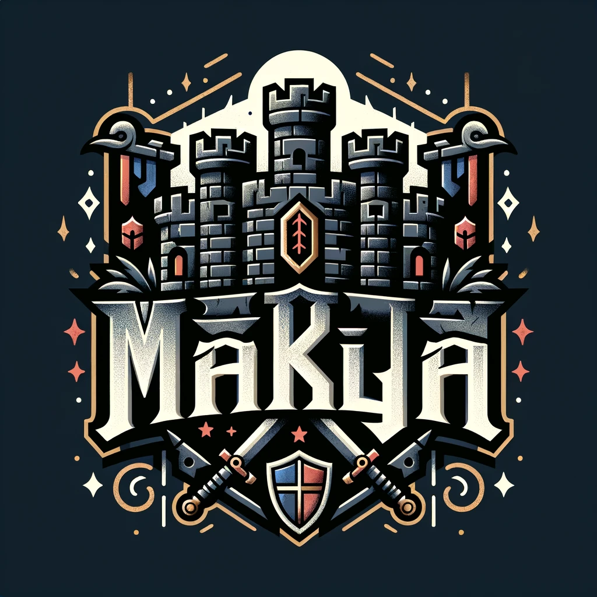
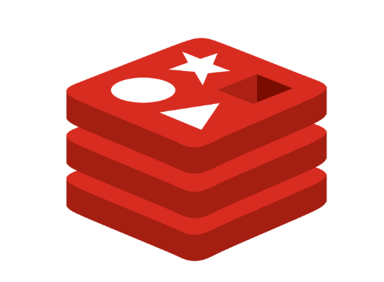
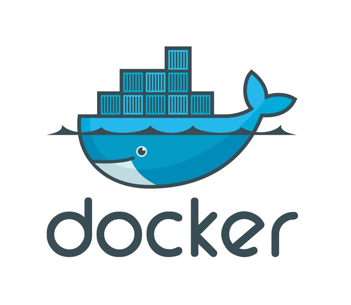
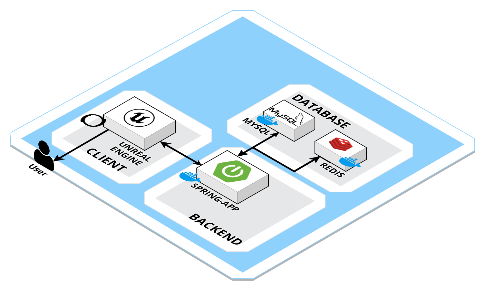
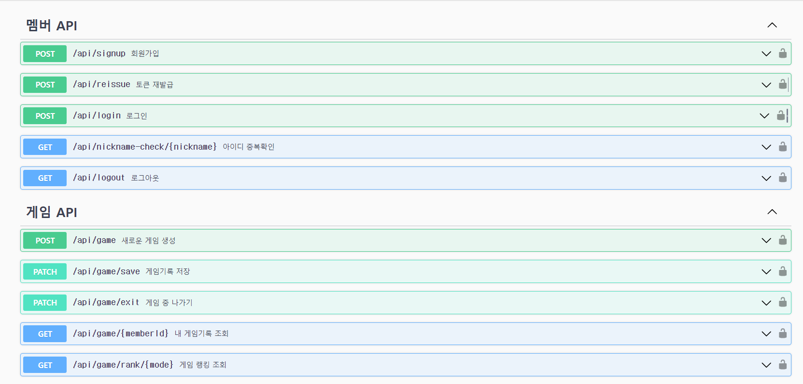
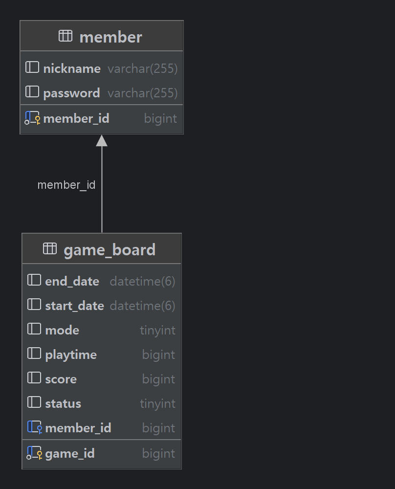
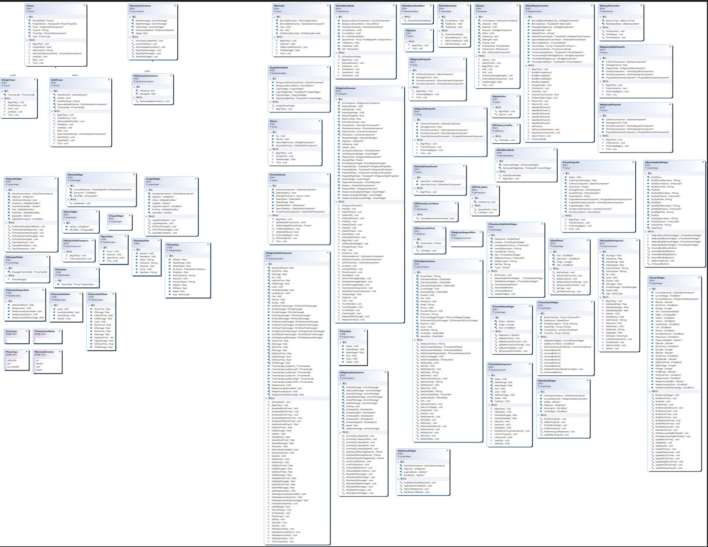

# Makja

# **📜 목차**

1. [서비스 소개](https://www.notion.so/README-d47fe0cc6542482cb92383db4eca1b04?pvs=21)
2. [기획 배경](https://www.notion.so/README-d47fe0cc6542482cb92383db4eca1b04?pvs=21)
3. [화면소개](https://www.notion.so/README-d47fe0cc6542482cb92383db4eca1b04?pvs=21)
4. [기술 스택](https://www.notion.so/README-d47fe0cc6542482cb92383db4eca1b04?pvs=21)
5. [기술 특이점](https://www.notion.so/README-d47fe0cc6542482cb92383db4eca1b04?pvs=21)
6. [서비스 아키텍처](https://www.notion.so/README-d47fe0cc6542482cb92383db4eca1b04?pvs=21)
7. [프로젝트 산출물](https://www.notion.so/README-d47fe0cc6542482cb92383db4eca1b04?pvs=21)

------

# **서비스 소개**

## **✨서비스 설명 ✨**

### **✨개요 ✨**

- 3D 타워 디펜스 게임
- 서비스 명 : Makja

### **🎯 타겟 🎯**

- 타워디펜스 게임을 좋아하고 즐기는 사람
- 기존 타워디펜스 게임에 아쉬움을 느끼는 사람
- 3D 액션 게임을 좋아하는 사람

# **✨기획 배경 ✨**

## **배경**

- 타워디펜스 게임은 선풍적인 인기를 끌고 있음
- 하지만 컨텐츠 다양성 부재로 타워건설-웨이브 방어의 패턴이 반복되어 흥미도 저하
- 유저가 직접 적을 처치하는 요소를 추가하여 새로운 재미를 제공

## **목적 🥅**

**유저가 직접 적을 처치하는 시스템을 추가하여 기존 타워디펜스게임과는 차별화된 기능을 제공하여 유저에게 새로운 재미 요소의 게임을 제공**

------

# 🕹️ **화면 소개**

## 1. 플레이어

------

- 이동
- 텔레포트
- 공격
- 레벨업
- 강화

## 2. 타워

------

- 카메라 전환
- 설치
- 강화
- 판매
- 공격
- 바리케이트 설치

## 3. 적

------

## 4. UI

------

- 로그인
- 로그아웃
- 회원가입
- 랭킹

# **✨ 기술 스택 ✨**

## **1. Redis**

> Redis는 주로 애플리케이션 캐시나 빠른 응답 속도를 가진 데이터베이스로 사용되는 오픈 소스 인메모리 NoSQL 저장소 입니다.

### **적용**

- **JWT Token을 사용한 로그인** 로그인시 사용되는 Refresh-token을 저장하기 위해서 사용하였으며 보안성을 강화하기 위해서 엑세스 토큰 갱신시에 리프레시 토큰도 같이 갱신되는 `Refresh Token Rotation` 방식을 채용하였습니다.

- **멤버의 online/offline 상태 관리**

  멤버의 online/offline 상태를 관리하기 위해서 loginStatus를 key로 등록하여 추적했습니다.

## **2. Docker**

> Docker는 컨테이너 기반의 오픈소스 가상화 플랫폼입니다.
>
> Docker를 사용하면 개발자는 어플리케이션을 빌드, 배포, 실행할 수 있습니다.
>
> Docker는 리눅스 컨테이너를 사용하여 어플리케이션을 패키징하고 실행하는데 사용됩니다.
>
> Docker는 어플리케이션을 더 빠르게 배포할 수 있게 해주고, 어플리케이션을 실행하는 환경을 일관되게 유지할 수 있습니다.

### **적용**

- **개발 환경 구축** 개발 환경을 구축하기 위해 사용하였습니다.
- **배포 환경 구축** 배포 환경을 구축하기 위해 사용하였습니다.

## **3. Jenkins**

> Jenkins는 오픈소스 자동화 서버입니다.
>
> Jenkins는 빌드, 테스트, 배포 등의 작업을 자동화할 수 있습니다.

### **적용**

- **CI/CD 파이프라인 구축**
- **배포 환경 구축**

## **4. Unreal(UE4)**

> Unreal은 3D 게임 엔진입니다.
>
> Unreal은 C++, 블루프린트를 활용하여 게임 프로젝트에 필요한 오브젝트들을 구성하고, 각 오브젝트들 간의 상호작용을 정의할 수 있습니다.

### **적용**

- 게임 환경 구축(Game Instance)
- 각 맵(Level) 별 게임 모드 및 상태 구축(Game Mode, Game State)
- 각 맵 별로 필요한 Actor, Pawn, Character, Projectile 구축
- Character와 Pawn의 입력에 대한 애니메이션 구현(Controller → Animation Montage)
- 버튼을 사용한 카메라 전환 구현
- 각 맵 별 UI 구현

------

# **🐰 기술 특이점**

## 언리얼

언리얼 엔진은 리얼타임 기술을 활용하는 모든 사용자를 위한 완벽한 게임 개발 툴 세트이다.

- 리얼타임 기술 :  가상공간을 딜레이 없이 실시간 렌더링(모델링 된 오브젝트를 시각화 해주는 것)을 통해 구현
  - 과거 : 특정 장면 또는 오브젝트를 현실에 가깝게 구현하기 위해 소요되는 시간이 길었다.
  - 현재 : 다양한 고퀄리티 에셋을 통해 같은 과정에 긴 시간을 들이지 않고 실시간으로 가상 현실(게임 내 공간)내에 에셋들이 배치되는, 특정 장면 구현을 위한 UV 맵핑 시간이 줄어들었다.
- 블루프린트 기술 : 기본 스크립트 언어인 C++을 시각화 하여 기능을 구현할 수 있게 도와주는 기술
  - 직접 코딩을 하지 않아도 블루프린트를 통해 프로그래밍 가능
- 압도적인 그래픽 성능 : 레이 트레이싱(Ray-Tracing) 기법을 활용하여 정밀한 빛 반사 효과 표현
  - 보다 더 현실감 있는 가상 세계 구현 가능
- 소스 코드 100% 활용 : 다른 게임 엔진에 비해 구조가 엄격
  - 오브젝트 성격에 맞는 부모 클래스를 선택하여, 해당 클래스에 있는 기능들을 활용

# **🐴 서비스 아키텍처**

------

# **🐰 프로젝트 산출물**

## **프로젝트 진행**

### 1. API 명세서

### 2. ERD

## 3. Game Classes (클래스 관계도)

